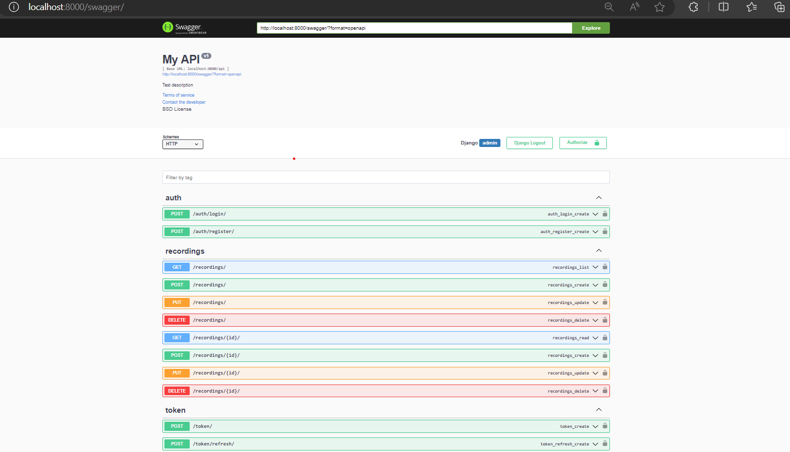

DentalBee

DentalBee is a full-stack application designed to manage dental practice operations. It includes a backend API developed in Django and a frontend built with React. The repository is Dockerized to simplify deployment.
Project Structure

    backend/: Django application for the backend API
    frontend/: React-based frontend application
    docker-compose.yml: Configures Docker services

Getting Started
Prerequisites

    Docker & Docker Compose installed.

Installation

    Clone the repository.
    Open bash terminal .
    Run cd backend
    Run  dos2unix entrypoint_back.sh
    Run cd ..
    Run cd frontend 
    Run dos2unix entrypoint_front.sh
    Run cd ..
    Run  docker-compose up --build

Usage

Access the application at http://localhost:3000 for the frontend and http://localhost:8000 for the backend API.

Backend : 

Frontend : 

Testing is being run automatically during the build up process in the .sh files 

HINT : react container takes time to build 